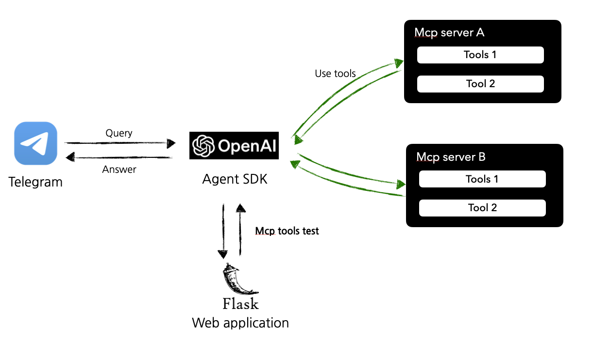
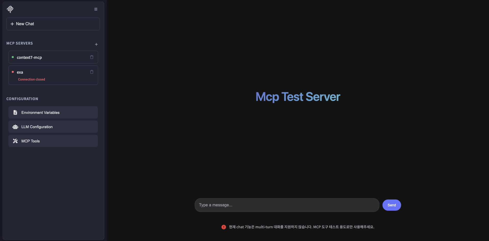

# Telegram MCP Bot

An extensible Telegram bot that uses LLMs (OpenAI or Ollama) and connects to MCP (Model Context Protocol) servers to perform tool‑augmented tasks. This project also includes a web application to easily configure and test MCP servers.

## Architecture


## Quick start

### 1) Prerequisites

- Install Python dependencies:
  ```bash
  pip install -r requirements.txt
  ```
- **(Optional)** For connecting to [Smithery.ai](https://smithery.ai/) servers, it is recommended to install Node.js and `npx`.

### 2) Configure Environment and LLM

Configuration is split into two files: `.env` for secrets and `llm_config.json` for LLM settings.

**a) Create a `.env` file** in the project root for secrets:

```env
# Telegram Bot
TELEGRAM_BOT_TOKEN="YOUR_TELEGRAM_BOT_TOKEN"

# OpenAI API Key (required if you use openai)
OPENAI_API_KEY="YOUR_OPENAI_API_KEY"

# Naver Search MCP server credentials
NAVER_CLIENT_ID="YOUR_NAVER_CLIENT_ID"
NAVER_CLIENT_SECRET="YOUR_NAVER_CLIENT_SECRET"
```

**b) Edit `llm_config.json`** for LLM provider settings:

This file configures which LLM provider to use (`openai` or `ollama`) and which model to use.

```json
{
    "llm_provider": "openai",
    "model_name": "gpt-4o-mini",
    "ollama_base_url": "http://localhost:11434/v1"
}
```

- When `llm_provider` is `"openai"`, `OPENAI_API_KEY` in `.env` is used.
- When `llm_provider` is `"ollama"`, the bot connects to an OpenAI-compatible endpoint at `ollama_base_url`.

### 3) Configure MCP Servers

`mcp_config.json` defines the MCP servers the bot will start and connect to. You can configure it in two ways:

1.  **(Recommended) Use the Web Application**: A simple way to add, manage, and test MCP servers.
2.  **Manually edit `mcp_config.json`**: Directly modify the configuration file.

A detailed guide is available in the "Extending the Bot" section below.

### 4) Run the Application

We recommend starting the web application first to configure and test your MCP servers.

**a) Run the Web Application:**

```bash
python frontend/app.py
```

Open your browser to the local address provided to manage your MCP servers.

**web application sample**


**b) Run the Telegram Bot:**

```bash
python main.py
```

Once running, open Telegram and send a message to your bot. The active agent will respond using the configured LLM and MCP tools.

## How it works

The bot operates with a single, powerful agent. This agent connects to the LLM you've configured (either from OpenAI or Ollama) and is equipped with all the tools provided by the MCP servers listed in `mcp_config.json`. When you send a message, the agent interprets your request, selects the appropriate tool from its available MCP capabilities, and responds accordingly.

## Extending the Bot: Adding MCP Tools

### 1) Add a New MCP Server

You can add any MCP-compatible server. This is particularly easy for servers listed on [Smithery.ai](https://smithery.ai/).

**Method A: Using the Web Application (Recommended)**

Start the web app (`python frontend/app.py`) and use the UI to add or remove MCP server configurations. The changes will be automatically saved to `mcp_config.json`.

**Method B: Manually Editing `mcp_config.json`**

You can add different types of servers:

- **Smithery Servers**: Find a server on Smithery and paste its configuration.
  ```json
  {
    "mcpServers": [
      {
        "command": "npx",
        "args": [
          "-y", "@smithery/cli@latest", "run", "@upstash/context7-mcp",
          "--key", "YOUR_SMITHY_KEY"
        ],
        "name": "context7-mcp"
      }
    ]
  }
  ```

- **Remote Servers**: Add a server by its name and URL.
  ```json
  {
      "name": "sample-mcp-server",
      "url": "https://sample-mcp-url.io"
  }
  ```

- **Local Python Servers**: Run a custom server from a local script.
  ```json
  {
      "args": ["src/naver_mcp_server.py"],
      "command": "python",
      "name": "naver-search-server"
  }
  ```

### 2) Implement a Custom Python MCP Server

You can create your own tools by implementing a local MCP server.
- Place your server script under the `src/` directory.
- Use `src/naver_mcp_server.py` as a reference for implementing the FastMCP interface.

## Logging

- Application logs are written to stdout and to `logs/bot.log`.

## Troubleshooting

- **Missing `TELEGRAM_BOT_TOKEN`**: Set it in your `.env` file.
- **`LLM_PROVIDER="openai"` fails**: Ensure `OPENAI_API_KEY` is set correctly in `.env`.
- **`LLM_PROVIDER="ollama"` fails**: Make sure a running Ollama instance with an OpenAI-compatible API is available at `OLLAMA_BASE_URL` and a valid model is specified in `llm_config.json`.
